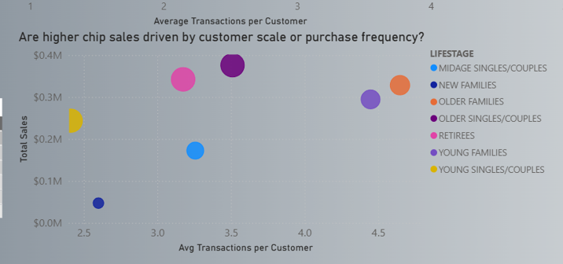
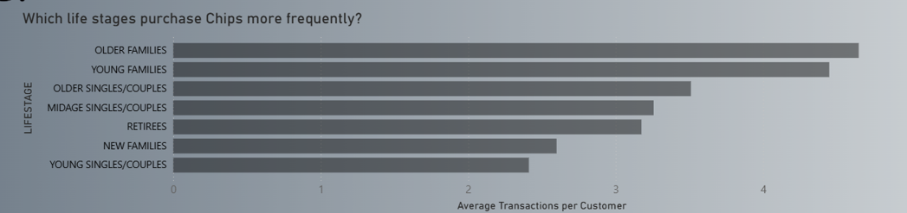
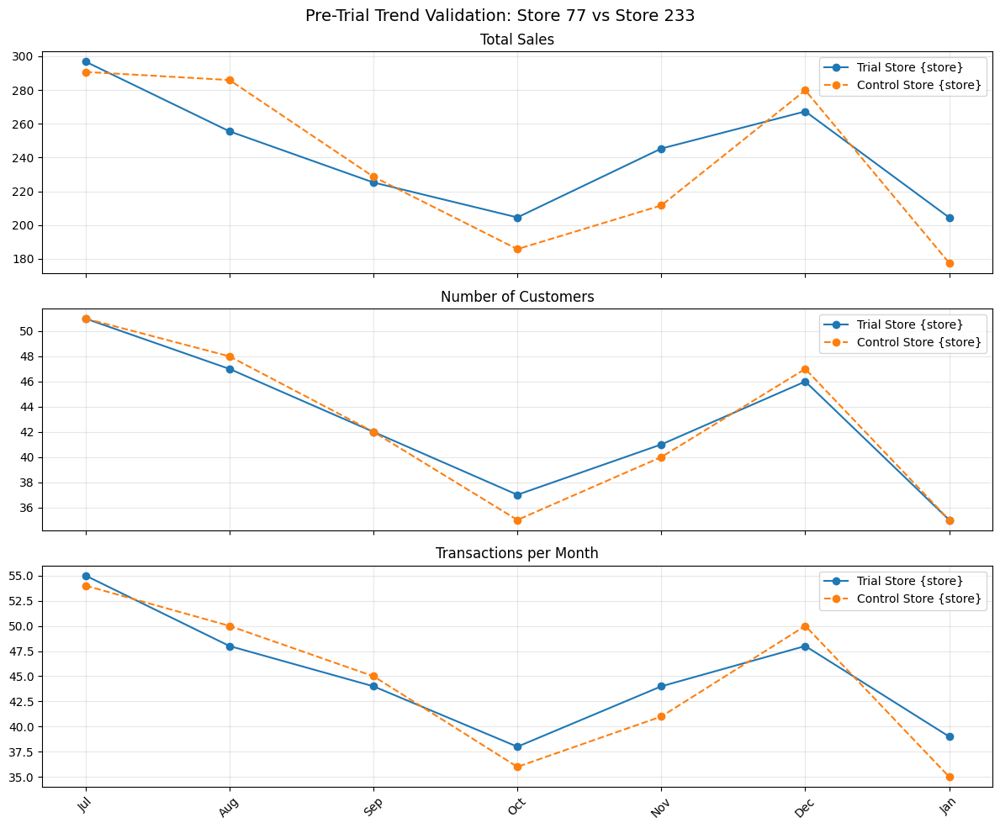
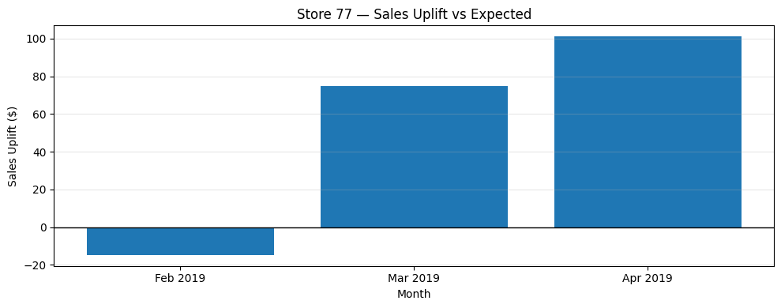
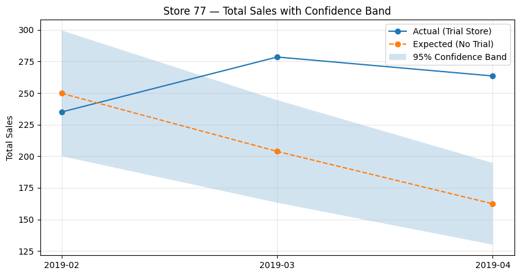

# Quantium Retail Analytics

**Customer Segmentation, Purchase Behavior & Store Trial Impact Evaluation**

## Project Overview

This repository presents a two-part retail analytics case study designed to replicate the type of analytical work performed within commercial analytics and strategy teams. The project focuses on understanding customer-driven demand patterns and rigorously evaluating the effectiveness of an in-store layout intervention using causal inference principles.

Rather than treating analysis as an end in itself, this project emphasizes **decision-oriented analytics**—linking data exploration, statistical validation, and business interpretation to concrete commercial recommendations.

The work is intentionally structured to reflect how analytics outputs are consumed in practice:
- **Exploratory analysis** to understand *what* is happening
- **Structured validation** to determine *why* it is happening
- **Synthesized reporting** to support *what should be done next*

## Repository Structure
```
├── chips_category_analysis.ipynb
│   └── Customer segmentation, purchase behavior analysis, and demand driver identification
│
├── store_trial_evaluation.ipynb
│   └── Trial vs control store selection, pre-trend validation, uplift estimation, and uncertainty analysis
│
├── quantium_analysis.pptx
│   └── Executive-level report structured using the Pyramid Principle
│
└── README.md
```

The notebooks contain the full analytical workflow, while the presentation distills findings into a format suitable for senior business stakeholders.

---

## Business Problem Context

Retail organizations regularly face two recurring analytical challenges:

### 1. Understanding Category Demand at a Customer Level

Sales growth can emerge from multiple underlying mechanisms:
- Acquiring more customers
- Increasing how often existing customers purchase
- Increasing spend per transaction

Without separating these effects, organizations risk making incorrect decisions—for example, investing heavily in price promotions when demand is actually driven by habitual purchasing behavior.

**This project addresses the question:**  
*What truly drives chip category sales across different customer life stages?*

### 2. Evaluating Store-Level Interventions Reliably

Store layout changes are costly to implement and difficult to reverse. As a result, decision-makers need high confidence that any observed performance improvement is:
- Causally linked to the intervention, and
- Not driven by seasonal variation, noise, or unrelated demand shifts

**This project addresses the question:**  
*Did the layout change create incremental value beyond what would have occurred naturally?*

---

## Analytical Approach & Design Principles

The analysis follows three guiding principles:

1. **Decomposition over aggregation**  
   Sales are decomposed into customer count, transaction frequency, and spend behavior rather than analyzed as a single metric.

2. **Causal defensibility over correlation**  
   Store performance is evaluated using trial–control logic and pre-trend validation rather than naive before–after comparisons.

3. **Decision relevance over metric completeness**  
   Only analyses that materially influence a business decision are emphasized in documentation and reporting.

---

## Part 1: Customer & Category Analysis

📓 **chips_category_analysis.ipynb**

### Objective

The first phase of the analysis focuses on understanding **who** drives chip sales and **how**. Rather than simply ranking segments by revenue, the analysis investigates *why* certain customer groups contribute more to total sales.

### Key Analytical Questions

- Are higher sales driven by a larger customer base or higher purchase frequency?
- Which customer life stages demonstrate consistently repeat-driven behavior?
- Which segments offer the most stable and predictable demand?

Answering these questions is essential for informing assortment planning, promotional strategy, and store layout prioritization.

### Final Visualizations (Notebook 1)

#### Revenue vs Purchase Frequency by Lifestage



This visualization compares customer segments along two critical dimensions:
- **Purchase frequency**, which reflects behavioral intensity, and
- **Total sales contribution**, which reflects overall commercial importance

By plotting these together, the analysis avoids misleading conclusions that can arise when looking at revenue alone.

**Insight:**  
High-revenue segments cluster around higher transaction frequency rather than unusually high spend per purchase. This indicates that category performance is driven primarily by repeat purchasing behavior, not one-time high-value transactions.

#### Average Transactions per Customer by Lifestage



This view isolates purchase frequency to identify which customer groups exhibit habitual buying patterns.

**Insight:**  
Older Families and Young Families demonstrate the highest purchase frequency, followed closely by Older Singles/Couples. These segments represent consistent, repeat-driven demand rather than volatile or episodic purchasing.

### Summary Insights — Customer Analysis

- Chip category performance is **behavior-driven**, not price-driven
- High-performing segments purchase **frequently and predictably**
- Low-frequency segments contribute less reliably to total sales, even when individual transactions are moderately priced

### Business Interpretation

From a strategic perspective, this implies that:
- Increasing visibility and availability for high-frequency segments is likely to generate stronger returns than broad-based discounting
- Store layout and assortment decisions should prioritize segments with stable purchasing patterns rather than attempting to stimulate infrequent buyers

---

## Part 2: Store Trial Evaluation

📓 **store_trial_evaluation.ipynb**

### Objective

The second phase evaluates whether a store layout intervention led to measurable, incremental improvements in store performance, after accounting for natural variation and external trends.

### Methodological Framework

The evaluation follows a structured causal framework:

1. **Trial and Control Store Selection**  
   Control stores are selected based on similarity in historical performance to ensure meaningful comparison.

2. **Pre-Trial Trend Validation**  
   Performance metrics are compared before the intervention to confirm parallel trends across:
   - Total sales
   - Number of customers
   - Transactions per customer

3. **Post-Trial Impact Assessment**  
   Expected (no-trial) performance is estimated and compared to observed outcomes.

4. **Uncertainty Quantification**  
   Confidence intervals are used to distinguish real uplift from random fluctuation.

### Why the README Focuses on a Single Store

While multiple trial stores were evaluated in the analysis, the README presents **Store 77** as a representative example. This approach improves clarity while preserving analytical integrity.

All trial stores were assessed using the same framework, and conclusions are based on consistent patterns observed across stores, not a single data point.

### Final Visualizations (Notebook 2)

#### Pre-Trial Trend Validation — Store 77

This visualization demonstrates that the trial and control stores followed closely aligned trajectories prior to the intervention.



**Interpretation:**  
The similarity in trends supports the assumption that post-trial divergence can reasonably be attributed to the layout change rather than pre-existing differences.



#### Sales Uplift vs Expected — Store 77

This chart quantifies incremental sales relative to the expected no-trial baseline.

**Interpretation:**  
Post-intervention sales exceed expected values, indicating positive incremental impact associated with the layout change.



#### Total Sales with 95% Confidence Interval — Store 77

This visualization places observed sales within an uncertainty band to assess statistical significance.

**Interpretation:**  
Actual performance exceeding the confidence interval strengthens confidence that the observed uplift reflects a genuine effect rather than random noise.

### Summary Insights — Trial Evaluation

- Pre-trial alignment validates the control store selection
- Post-trial uplift is directionally consistent and statistically defensible
- Performance improvement is driven by behavioral changes rather than temporary customer spikes

---

## Executive Reporting & Pyramid Principle

Findings from both analytical phases were consolidated into an executive presentation (**[Quantium_analysis](reports/quantium_analysis.pptx)**) structured using the Pyramid Principle.

**Structure:**
1. Clear top-line recommendation
2. Supporting insights
3. Analytical evidence

This approach ensures stakeholders can quickly grasp conclusions while retaining access to analytical justification when required.

---

## Final Recommendations

1. **Proceed** with broader rollout of layout changes in stores with similar profiles
2. **Focus** future optimization efforts on high-frequency customer segments
3. **Institutionalize** trial–control evaluation for future interventions
4. **Avoid** relying solely on aggregate sales metrics without behavioral decomposition

---

## Contact & Usage

This project demonstrates analytical rigor suitable for retail strategy, commercial analytics, and data science roles. For questions or collaboration inquiries, please reach out via the repository contact information.
